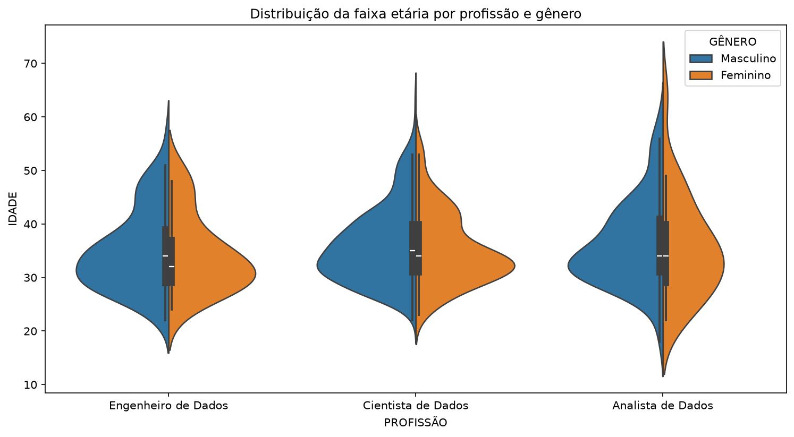
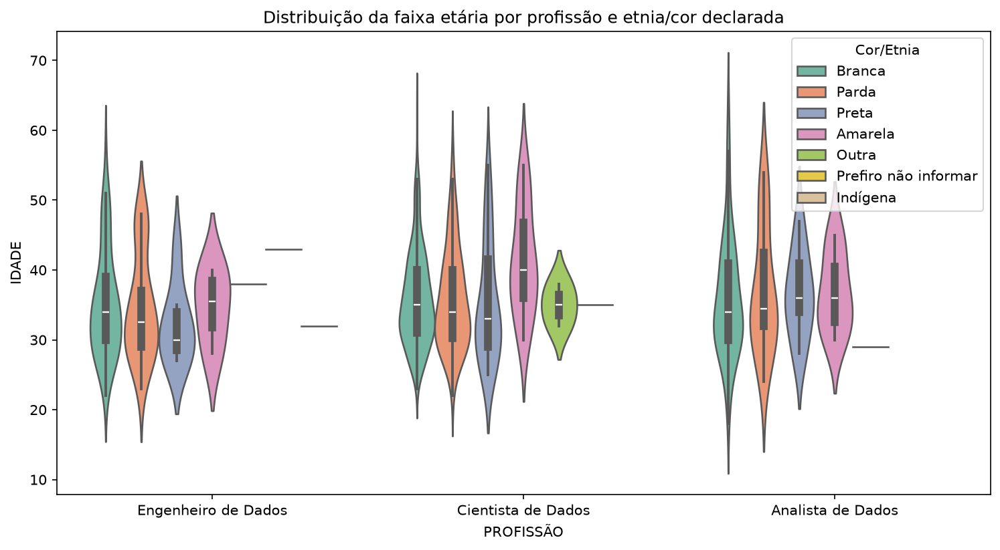

# 📊 State of Data Brasil 2023 — Análise do Mercado de Dados

<p align="left">
  
  
  
  
</p>

Análise exploratória do dataset **State of Data Brasil 2023**, com foco no perfil de profissionais da área de dados no Brasil.

---

## Pipeline de Análise

- Importação e leitura do dataset (CSV)
- Tratamento de valores ausentes e inconsistentes
- Renomeação e padronização de colunas
- Filtragem e criação de subconjuntos analíticos
- Visualização de distribuições e comparações
- Extração de insights

---

## Tecnologias

- Python 
- Pandas  
- Matplotlib  
- Seaborn  
- Jupyter Notebook  

---

## Como executar

```bash
pip install -r requirements.txt
```

Para reproduzir exatamente o ambiente usado no desenvolvimento (todas as dependências transitivas fixadas), use o lockfile gerado com [`uv`](https://docs.astral.sh/uv/) em vez do comando acima:

```bash
pip install -r requirements-lock.txt
```

> ⚠️ Se tiver mais de uma instalação de Python na máquina, certifique-se de selecionar o mesmo interpretador tanto para instalar as dependências quanto como kernel do notebook (no VS Code: botão "Select Kernel" no canto superior direito do notebook).

Baixe o dataset seguindo as instruções em [`data/README.md`](data/README.md) e rode o notebook [`analise_state_of_data_br_2023.ipynb`](analise_state_of_data_br_2023.ipynb).

---

## Principais Visualizações

### Distribuição de idade por gênero e profissão

<p align="center">
  
</p>

---

### Distribuição de idade por etnia/cor e profissão

<p align="center">
  
</p>

---

## Principais insights

- **Ciência de Dados concentra a maior amostra analisada:** somando os dois gêneros, o resumo por gênero registra 535 cientistas de dados, contra 120 analistas e 117 engenheiros de dados.
- **A participação feminina é minoritária nas três funções:** aproximadamente 17,4% em Ciência de Dados, 20,8% em Análise de Dados e 20,5% em Engenharia de Dados.
- **As médias de idade são próximas entre os gêneros:** dentro de cada profissão, a diferença observada não ultrapassa 0,8 ano; as médias ficam entre 34,4 e 36,3 anos.
- **A distribuição por cor/etnia é desigual:** pessoas brancas formam a maioria nos três grupos. O resumo registra apenas uma pessoa indígena, em Engenharia de Dados, indicando baixa representação na amostra.

> Estes resultados descrevem somente o recorte selecionado do **State of Data Brasil 2023**. Como a pesquisa é observacional e alguns grupos possuem poucas respostas, os números não demonstram causas nem permitem concluir sobre retenção profissional.

---

## Dados tratados e tabelas-resumo

Os DataFrames tratados e as tabelas-resumo (idade média e contagem por profissão, gênero e etnia) usados nas análises acima são exportados pelo próprio notebook em `data/processed/` ao executá-lo. Essa pasta não é versionada no repositório — os arquivos são gerados localmente a cada execução.

---

<p align='center'>Developed by <strong>Liane Heidemann</strong><p>

